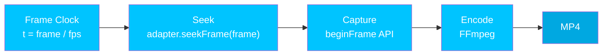

# 결정적 렌더링

> 동일한 입력, 동일한 출력. 매번.

Hyperframes는 핵심 보장을 기반으로 구축되었습니다: **동일한 [컴포지션](/concepts/compositions)은 항상 동일한 영상을 생성합니다**. 이것이 자동화된 파이프라인, CI 테스트, AI 기반 워크플로우를 신뢰할 수 있게 만드는 원리입니다.

## 작동 원리

렌더링 파이프라인은 프레임 단위이며 시크(seek) 기반입니다. 실시간 재생은 사용되지 않으며, 모든 프레임은 독립적으로 시크되어 캡처됩니다.

<Steps>
  <Step title="프레임 클록">
    [엔진](/packages/engine)은 정수 연산을 사용하여 각 프레임의 시간을 계산합니다: `time = floor(frame) / fps`. 시스템 시계에 대한 의존성이 없으며, 렌더링은 실시간과 완전히 분리됩니다.
  </Step>

  <Step title="시크">
    [프레임 어댑터](/concepts/frame-adapters)가 `seekFrame(frame)` 호출을 받아 모든 애니메이션, DOM 상태, 캔버스 콘텐츠를 해당 프레임에 맞게 결정적으로 배치합니다. 어댑터의 `renderSeek`는 모든 [GSAP](/guides/gsap-animation) 타임라인을 일시 정지하고 계산된 시간으로 시크합니다.
  </Step>

  <Step title="캡처">
    Chrome의 `HeadlessExperimental.beginFrame` API가 현재 프레임의 픽셀 버퍼를 캡처합니다. 이것은 단일 원자적 작업으로, 부분 페인트나 경쟁 조건이 발생하지 않습니다.
  </Step>

  <Step title="인코딩">
    FFmpeg가 캡처된 프레임들을 최종 MP4 영상으로 인코딩합니다. `&lt;audio&gt;`와 `&lt;video&gt;` 요소의 오디오 트랙은 이 단계에서 믹싱됩니다.
  </Step>
</Steps>



## 결정성을 보장하는 요소

* **시스템 시계 비의존** -- 렌더링은 `Date.now()`, `requestAnimationFrame`, 시스템 타이머를 사용하지 않습니다
* **시드 없는 난수 사용 금지** -- 시드 없이 `Math.random()`을 사용하면 결정성이 깨집니다
* **렌더링 시점 네트워크 요청 금지** -- 모든 에셋은 렌더링 시작 전에 로드되어야 합니다
* **고정된 출력 매개변수** -- `fps`, `width`, `height`는 첫 번째 프레임 전에 확정됩니다
* **유한한 길이** -- 모든 [컴포지션](/concepts/compositions)은 알려진 유한한 길이를 가집니다

이 규칙들은 모든 [프레임 어댑터](/concepts/frame-adapters)에 동일하게 적용됩니다. 커스텀 어댑터를 만드는 경우, [결정성 계약](/concepts/frame-adapters#determinism-contract)을 따라야 합니다.

## Docker 모드

최대한의 재현 가능성을 위해 Docker에서 렌더링하세요:

```bash theme={null}
npx hyperframes render --docker --output output.mp4
```

Docker 모드는 정확한 Chrome 버전과 폰트 세트를 사용하여 다음을 보장합니다:

* 모든 플랫폼에서 동일한 Chromium 렌더링 엔진
* 동일한 시스템 폰트 (플랫폼별 폰트 대체 없음)
* 동일한 FFmpeg 인코더 버전

모든 렌더링 옵션은 [렌더링 가이드](/guides/rendering)를 참조하세요.

## 미리보기와 렌더링의 일치성

브라우저 미리보기와 렌더링된 MP4는 일치해야 합니다. Hyperframes는 다음을 통해 이를 달성합니다:

* **단일 런타임** -- 동일한 `hyperframe.runtime`이 미리보기와 렌더링 모두를 구동합니다
* **프로듀서 기준 동작** -- [프로듀서](/packages/producer)의 시크 의미 체계가 기준이 됩니다
* **준비 게이트** -- `__playerReady`와 `__renderReady`가 프레임 캡처 전에 [컴포지션](/concepts/compositions)이 완전히 로드되었는지 확인합니다

여기서 일치성이란 **시각적 충실도**를 의미합니다 — 모든 프레임이 동일하게 보입니다. 성능 일치를 의미하는 것은 *아닙니다*. 미리보기는 브라우저에서 실시간으로 재생되므로 프레임 레이트가 하드웨어에 의해 제한됩니다. 렌더링은 시크 기반이며 프레임 단위로 처리되므로 프레임별 비용에 관계없이 프레임이 누락되지 않습니다. 미리보기에서 끊기는 컴포지션도 렌더링은 완벽하게 될 수 있습니다. 이유는 [성능](/guides/performance)을 참조하세요.

<Note>
  로컬 렌더링(Docker 미사용)은 플랫폼별 폰트 렌더링과 Chrome 버전으로 인해 미세한 차이가 있을 수 있습니다. 정확한 재현 가능성이 중요한 경우 Docker 모드를 사용하세요.
</Note>

## 어댑터 개발자를 위한 안내

[프레임 어댑터](/concepts/frame-adapters)를 만드는 경우, 어댑터는 결정성 계약을 따라야 합니다:

* `seekFrame(frame)`은 멱등적이어야 합니다 -- 동일한 프레임, 동일한 결과
* 호출 순서에 의존하는 부작용이 없어야 합니다 (랜덤 액세스를 처리할 수 있어야 합니다)
* 프레임이 "커밋"된 후에 해결되는 비동기 작업이 없어야 합니다
* 깔끔한 생명 주기: `init` -> `seekFrame` (N회) -> `destroy`

## 다음 단계

<CardGroup cols={2}>
  <Card title="프레임 어댑터" icon="plug" href="/concepts/frame-adapters">
    결정성 계약을 준수하는 어댑터 만들기
  </Card>

  <Card title="렌더링" icon="film" href="/guides/rendering">
    로컬 또는 Docker에서 MP4로 렌더링하기
  </Card>

  <Card title="@hyperframes/producer" icon="clapperboard" href="/packages/producer">
    결정적 출력을 관리하는 전체 렌더링 파이프라인
  </Card>

  <Card title="흔한 실수" icon="triangle-exclamation" href="/guides/common-mistakes">
    결정성을 깨뜨리는 실수와 그 해결 방법
  </Card>
</CardGroup>
