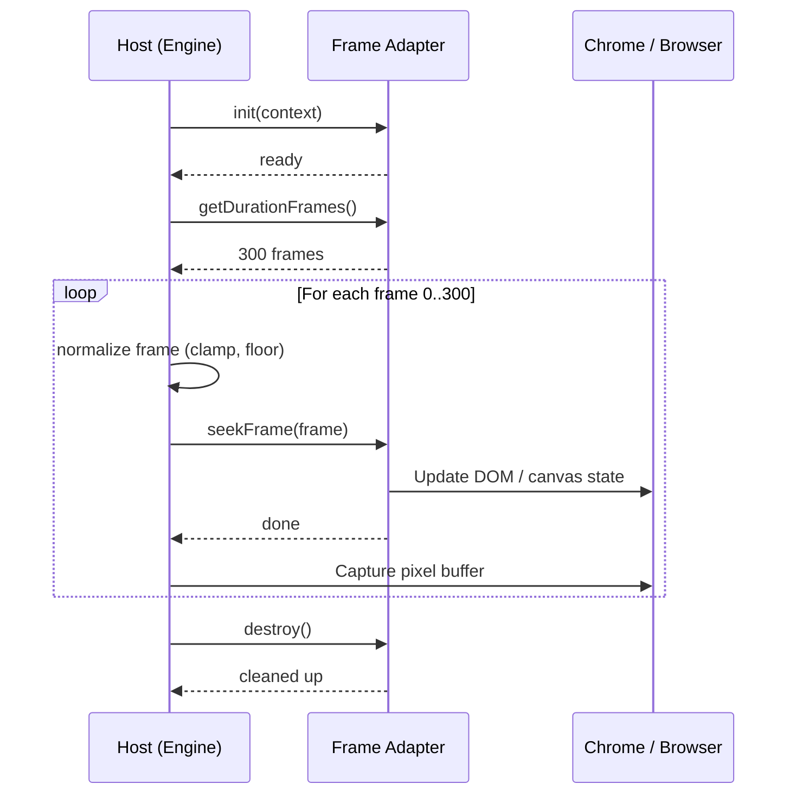

# 프레임 어댑터

> Hyperframes에 원하는 애니메이션 런타임을 연결하세요.

Frame Adapter 패턴은 Hyperframes가 다양한 애니메이션 런타임을 지원하는 방식입니다. 모든 어댑터가 답해야 할 핵심 질문은 다음과 같습니다:

> 프레임 N에서 화면은 어떤 모습이어야 하는가?

이 질문에 답할 수 있는 런타임이라면, Hyperframes에 연결할 수 있습니다.

<Info>
  Adapter API는 현재 **v0**(실험적) 단계입니다. v1이 될 때까지 호환성을 깨는 변경이 있을 수 있습니다. 핵심 계약(프레임 단위 탐색, 결정론적 출력)은 안정적이지만, 메서드 시그니처는 변경될 수 있습니다.
</Info>

## 작동 방식

호스트 애플리케이션([engine](/packages/engine) 또는 [producer](/packages/producer))이 엄격한 순서로 어댑터 메서드를 호출하여 렌더링을 주도합니다. 어댑터는 자체 클록을 제어하지 않으며, 탐색 명령에 응답만 합니다.



## Adapter API (v0)

```typescript adapters/types.ts theme={null}
type FrameAdapterContext = {
  compositionId: string;
  fps: number;
  width: number;
  height: number;
  rootElement?: HTMLElement;
};

type FrameAdapter = {
  id: string;
  init?: (ctx: FrameAdapterContext) => Promise<void> | void;
  getDurationFrames: () => number;
  seekFrame: (frame: number) => Promise<void> | void;
  destroy?: () => Promise<void> | void;
};
```

## 필수 시맨틱

* `getDurationFrames()`는 0 이상의 유한한 정수를 반환해야 합니다
* `seekFrame(frame)`은 임의의 탐색 순서(전진, 후진, 랜덤)를 지원해야 합니다
* `seekFrame(frame)`은 동일한 입력 프레임에 대해 멱등성을 보장해야 합니다
* `seekFrame(frame)`은 내부 시간을 어댑터 범위 내로 클램프해야 합니다
* 어댑터는 클록 기반이 아닌, 일시정지/탐색 기반으로 동작해야 합니다

## 호스트 오케스트레이션

호스트는 어댑터를 호출하기 전에 프레임을 정규화합니다:

```typescript engine/render-loop.ts theme={null}
normalizedFrame = clamp(Math.floor(frame), 0, durationFrames);
```

일반적인 렌더 루프:

```typescript engine/render-loop.ts theme={null}
await adapter.init?.({ compositionId, fps, width, height, rootElement });
const durationFrames = adapter.getDurationFrames();

for (let frame = 0; frame <= durationFrames; frame += 1) {
  await adapter.seekFrame(frame);
  // capture pixel buffer for this frame
}

await adapter.destroy?.();
```

## 결정론 계약

이 규칙들은 모든 어댑터에 대해 협상 불가입니다. Hyperframes의 [결정론적 렌더링](/concepts/determinism) 보장의 기반이 됩니다.

* 기준 클록: `t = frame / fps`
* 벽시계 의존성 금지 (`Date.now`, 드리프트 의존 로직)
* 시드 없는 랜덤 금지
* 렌더 시점 네트워크 요청 금지
* 고정된 출력 매개변수 (`fps`, `width`, `height`)
* 유한 재생 시간만 허용
* 탐색 전 결정론적 프레임 양자화

## 지원 런타임

퍼스트 파티 어댑터:

| 런타임                         | 탐색 방법                          | 상태      |
| ------------------------------ | ---------------------------------- | --------- |
| [GSAP](/guides/gsap-animation) | `timeline.seek(frame / fps)`       | 사용 가능 |
| CSS/WAAPI                      | `animation.currentTime`            | 계획됨    |
| Lottie                         | 애니메이션 프레임/진행률 설정      | 계획됨    |
| Three.js/WebGL                 | 결정론적 장면 상태 계산            | 계획됨    |
| SVG/Anime                      | 탐색 + 재생 시간 계약 구현         | 계획됨    |

커뮤니티 어댑터도 환영합니다 -- 프레임 단위 탐색이 가능하다면, Hyperframes에 연결할 수 있습니다.

## 적합성 테스트

모든 어댑터는 다음 최소 테스트를 통과해야 합니다:

1. **반복성** -- 동일한 프레임을 두 번 탐색하면 동일한 출력을 얻어야 합니다
2. **랜덤 탐색** -- 탐색 순서 `[90, 10, 50, 10]`이 결정론적 결과를 생성해야 합니다
3. **경계값** -- 음수 및 오버플로우 프레임 값이 오류를 발생시키지 않아야 합니다
4. **재생 시간** -- 반환된 재생 시간이 유한한 정수여야 합니다
5. **정리** -- `destroy` 이후 타이머/리스너 누수가 없어야 합니다

## 다음 단계

<CardGroup cols={2}>
  <Card title="결정론적 렌더링" icon="lock" href="/concepts/determinism">
    어댑터가 준수해야 하는 결정론 보장을 이해합니다
  </Card>

  <Card title="GSAP 애니메이션" icon="wand-magic-sparkles" href="/guides/gsap-animation">
    퍼스트 파티 GSAP 어댑터의 실제 동작을 확인합니다
  </Card>

  <Card title="@hyperframes/engine" icon="gear" href="/packages/engine">
    렌더링 중 어댑터를 구동하는 캡처 엔진입니다
  </Card>

  <Card title="기여하기" icon="code-branch" href="/contributing">
    나만의 어댑터를 만들고 기여하세요
  </Card>
</CardGroup>
